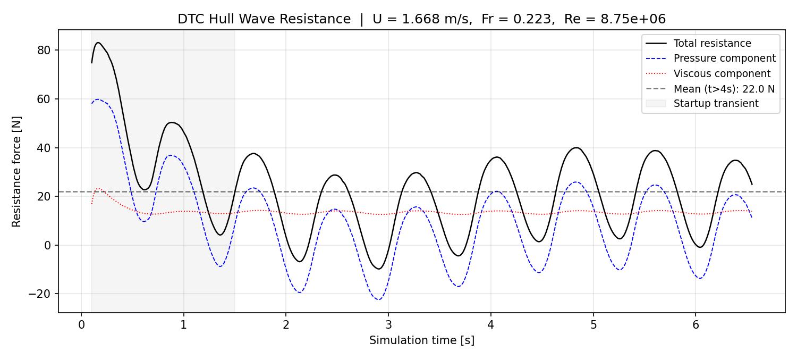
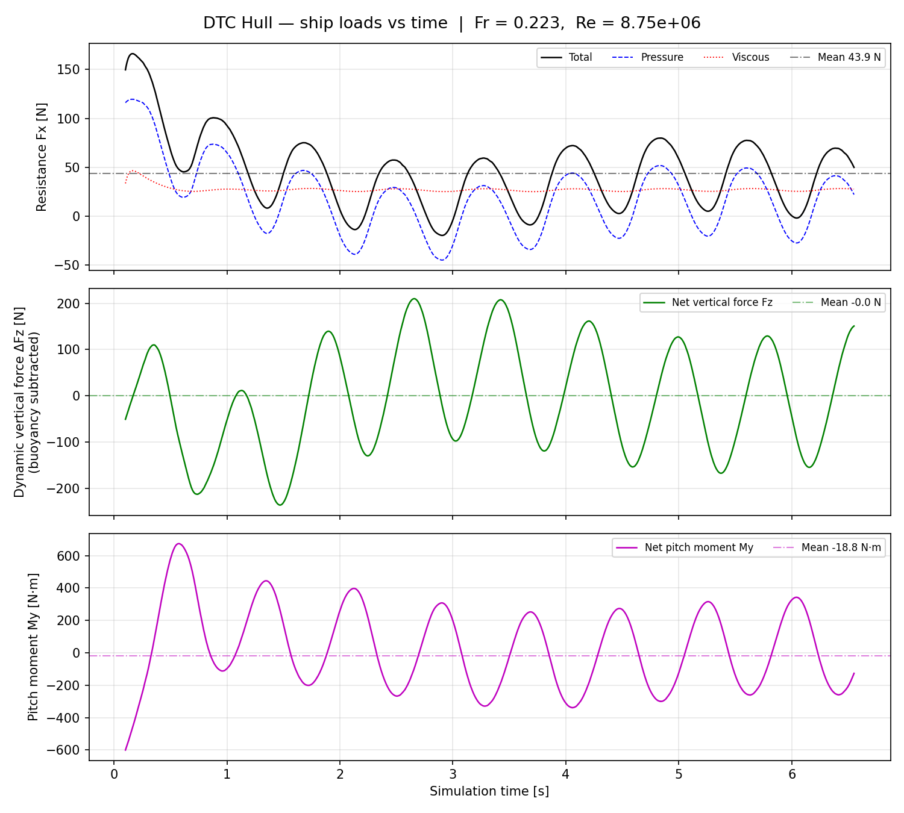
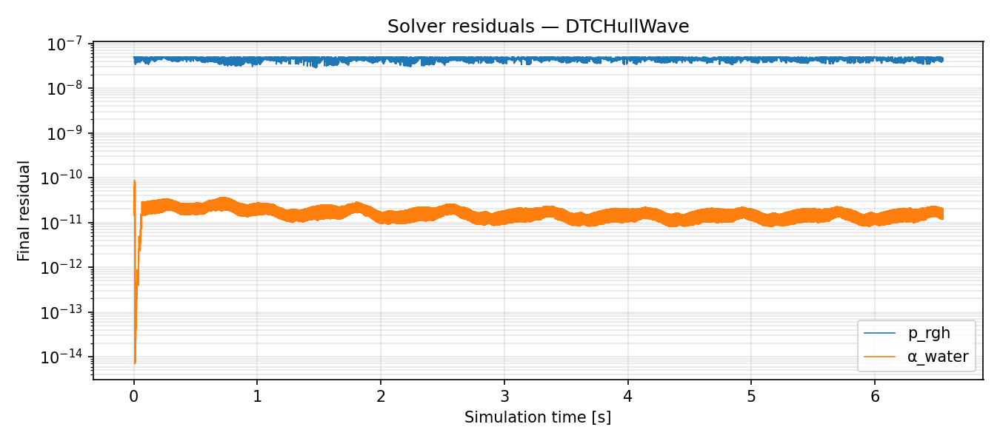
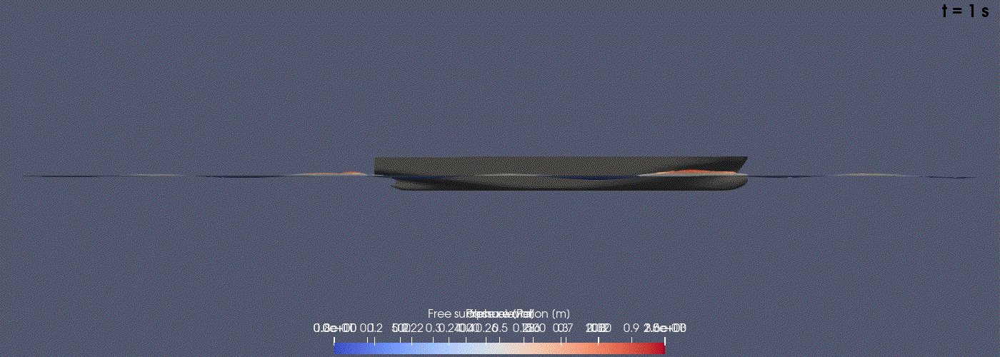
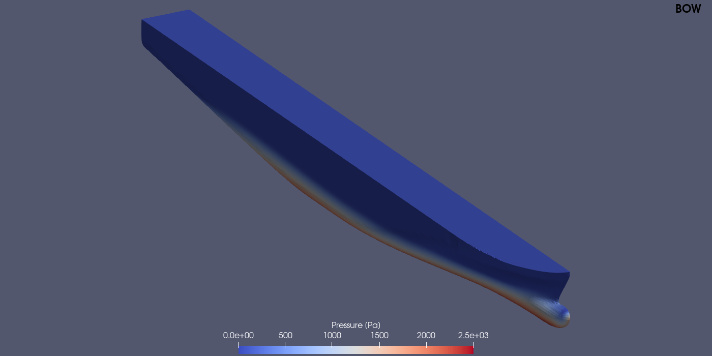
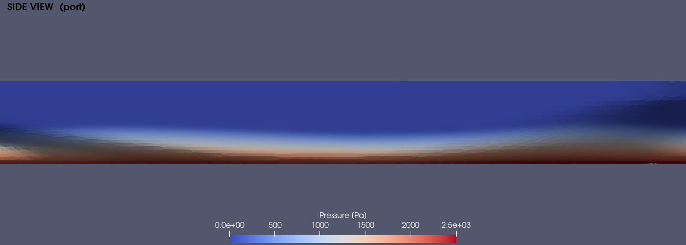
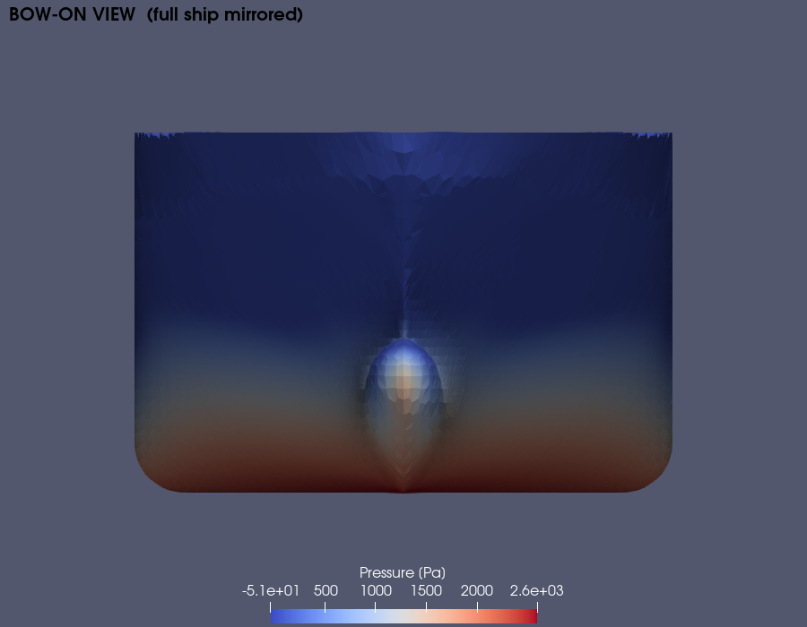

# DTCHullWave — OpenFOAM 13 Ship Wave Resistance

Simulation of the **DTC (Duisburg Test Case) container ship** advancing through head seas using the `interFoam` solver. The hull undergoes free heave and pitch via a 2-DOF rigid-body motion model. Wave resistance, dynamic trim, and the Kelvin wake pattern are computed from a Reynolds-Averaged Navier-Stokes simulation with a VOF free surface.

---

## Physical Setup

| Parameter | Value |
|---|---|
| Hull | DTC container ship (Lpp = 5.72 m, model scale) |
| Ship speed U | 1.668 m/s |
| Froude number Fr | 0.223 |
| Reynolds number Re | 8.75 × 10⁶ |
| Water density ρ | 998.8 kg/m³ |
| Kinematic viscosity ν | 1.09 × 10⁻⁶ m²/s |
| Incident waves | Stokes 2nd order, λ = 3 m, a = 0.04 m |
| Wave direction | Head seas (opposing bow) |
| Degrees of freedom | Heave + pitch (2-DOF Euler-implicit rigid body) |
| Domain | Half-ship with symmetry plane at y = 0 |

---

## Mesh

| Parameter | Value |
|---|---|
| Total cells | ~960,000 |
| Base mesh | Hexahedral blockMesh background |
| Hull surface | snappyHexMesh with 3 boundary layers |
| Free-surface band | Locally refined around z ≈ 0 waterline |

Generated with: `blockMesh` → `surfaceFeatures` → `snappyHexMesh` → `refineMesh` → `renumberMesh`

---

## Physics Models

### Free Surface — Volume of Fluid (VOF)

`alpha.water` transports the water volume fraction. MULES flux compression keeps the air–water interface sharp. Both phases are treated as incompressible Newtonian fluids.

### Turbulence

k–ω SST for the water phase; zero-equation model for air.

### Rigid-Body Motion

The hull heaves freely in z and pitches about y at each time step. The `rigidBodyMotion` dynamic mesh solver deforms the surrounding mesh accordingly. Forces, moments, and centre-of-rotation are written to `postProcessing/rigidBodyForces/` every time step.

---

## Solver Setup

| Setting | Value |
|---|---|
| Solver | `interFoam` |
| Time discretisation | Euler implicit |
| Pressure–velocity coupling | PIMPLE (3 outer iterations) |
| Courant number limit | Co < 0.5 (adaptive dt) |
| Simulated time | 6.54 s |

---

## Results

### Resistance Time History

**Total, pressure, and viscous resistance vs time:**


| Quantity | Value |
|---|---|
| Mean total resistance (t > 4 s) | **43.9 N** |
| Pressure (wave-making) component | 17.0 N (39%) |
| Viscous (friction) component | 27.0 N (61%) |

The solution settles by t ≈ 2–3 s. Residual oscillations after that are driven by the periodic Stokes wave field exciting heave and pitch. The simulation uses a half-domain (symmetry at y = 0), so forces on the half-hull patch are doubled to give full-ship loads. The viscous component dominates at Fr = 0.223 — the hull is running well below its hull speed, so wave-making resistance is modest and skin friction is the primary contributor.

### Ship Loads vs Time

**Resistance (Fx), vertical force (Fz), and pitch moment (My) vs time:**


All loads settle by t ≈ 2–3 s. Fz is the **dynamic** vertical force (static buoyancy subtracted) — the small residual reflects the additional sinkage as the hull accelerates to its running trim. My shows the bow-down pitching moment driven by the high bow stagnation pressure. Oscillations after settling are periodic excitation from the Stokes incident wave field.

### Convergence

**Solver residuals for p_rgh, α_water, and Ux:**


### Wave Pattern

**Free-surface elevation (α = 0.5 isosurface, coloured by elevation) at t = 1–6 s:**


The bow wave establishes within the first ~2 s. By t ≈ 3 s the Kelvin wake pattern is stationary — the diverging bow waves and transverse stern waves are clearly visible alongside the hull.

**Water volume fraction on the centreline symmetry plane (t = 5 s):**


The sharp blue-to-red transition marks the free surface. Bow and stern wave crests stand above the undisturbed waterline; the Kelvin trough runs along the hull midbody.

### Hull Surface Pressure

**Isometric view from bow:**


**Port side view:**


**Bow-on view (full ship, mirrored across symmetry plane):**


The bow stagnation zone (red, ~2500 Pa) is the dominant source of wave-making resistance. Pressure drops sharply to near-ambient along the midbody and stern. The bow-on view shows the pressure is symmetric across the centreline and highest at the keel waterline where the hull is fullest.

---

## Running the Case

```bash
source /opt/openfoam13/etc/bashrc
cd openfoam-DTCHullWave
./Allmesh                  # blockMesh + snappyHexMesh + refineMesh + setWaves
decomposePar
mpirun -np 8 foamRun -parallel > log.foamRun 2>&1 &
reconstructPar
python3 post_process.py    # resistance history + convergence plots
PYTHONPATH=/usr/lib/python3/dist-packages pvpython render_fields.py  # field images + GIF
```

---

## References

el Moctar, O., Shigunov, V., & Zorn, T. (2012). Duisburg Test Case: Post-panamax container ship for benchmarking. *Ship Technology Research*, 59(3), 50–64.

OpenFOAM Foundation (2024). *DTCHullWave tutorial*, `$FOAM_TUTORIALS/incompressibleVoF/DTCHullWave`.
